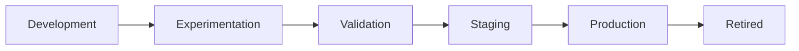
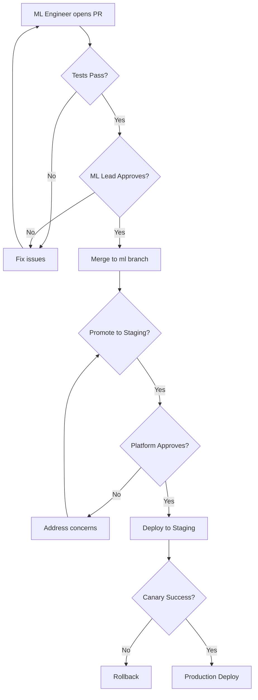

# Model Lifecycle & Promotion Rules

> **Status**: P0 Documentation — Policy First, Code Later

## Overview

This document defines the lifecycle of ML models from development to production, including promotion gates, ownership, and rollback procedures.

---

## Model Lifecycle Stages



| Stage | Environment | Owner | Purpose |
|-------|-------------|-------|---------|
| Development | Local | ML Engineer | Initial model development |
| Experimentation | Dev cluster | ML Engineer | Hyperparameter tuning, A/B tests |
| Validation | Dev cluster | ML Lead | Performance validation |
| Staging | Staging cluster | Platform | Integration testing |
| Production | Prod cluster | Platform | Live inference |
| Retired | Archive | Platform | Deprecated models |

---

## Model Storage

### Where Models Live

| Artifact | Location | Access |
|----------|----------|--------|
| Training code | `/ml/models/<model-name>/` | ML team |
| Model weights | Model Registry (MLflow/DVC) | ML team + Platform |
| Serving configs | `/infra/kubernetes/ml/` | Platform |
| Inference endpoints | KServe / Triton | Platform |

### Model Registry Structure
```
registry/
├── <model-name>/
│   ├── v1.0.0/
│   │   ├── model.pkl
│   │   ├── metadata.json
│   │   └── metrics.json
│   ├── v1.1.0/
│   └── latest -> v1.1.0
```

---

## Promotion Gates

### Dev → Staging

| Gate | Requirement | Enforced By |
|------|-------------|-------------|
| Unit Tests | All tests pass | CI Pipeline |
| Code Review | 1 ML team approval | GitHub |
| Model Metrics | Meets baseline thresholds | ML Pipeline |
| Data Validation | Input schema validated | Great Expectations |

### Staging → Production

| Gate | Requirement | Enforced By |
|------|-------------|-------------|
| Integration Tests | E2E tests pass | CI Pipeline |
| Performance | Latency < SLA, Throughput > baseline | Load tests |
| Security | No vulnerabilities | Security scan |
| Platform Review | 1 Platform approval | GitHub |
| Canary | 10% traffic for 24h with no errors | Platform |

---

## Approval Workflow



### Approvers

| Transition | Required Approvers |
|------------|-------------------|
| Feature → ml | 1 ML team member |
| ml → develop | 1 ML Lead |
| develop → main | 1 Platform + 1 ML Lead |

---

## Rollback Procedures

### Automatic Rollback Triggers

| Trigger | Threshold | Action |
|---------|-----------|--------|
| Error rate | > 5% for 5 min | Revert to previous version |
| Latency | p99 > 2x baseline for 10 min | Revert to previous version |
| Health check | 3 consecutive failures | Revert to previous version |

### Manual Rollback

```bash
# Rollback in KServe
kubectl rollout undo inferenceservice/<model-name> -n inflow-ml

# Rollback in Model Registry
mlflow models update --name <model> --version <old-version> --stage Production
```

### Rollback Checklist

1. [ ] Identify failing version
2. [ ] Trigger rollback (auto or manual)
3. [ ] Verify previous version is serving
4. [ ] Create incident report
5. [ ] Root cause analysis within 48h

---

## Model Versioning

### Semantic Versioning

```
<major>.<minor>.<patch>

Examples:
- 1.0.0 → Initial production release
- 1.1.0 → New features, backward compatible
- 1.1.1 → Bug fixes
- 2.0.0 → Breaking changes (new input schema)
```

### Version Metadata

Every model version must include:

```json
{
  "version": "1.2.0",
  "created_at": "2024-01-15T10:00:00Z",
  "created_by": "ml-engineer@example.com",
  "git_commit": "abc123",
  "training_data_version": "dataset-v3",
  "metrics": {
    "accuracy": 0.95,
    "f1_score": 0.92,
    "latency_p99_ms": 45
  }
}
```

---

## Ownership Matrix

| Responsibility | Owner |
|----------------|-------|
| Model code | ML Team |
| Training pipelines | ML Team |
| Model registry | Platform |
| Serving infrastructure | Platform |
| Monitoring & alerts | Platform |
| Rollback decisions | Platform (with ML input) |

---

> ⚠️ **This document is policy, not implementation.** Actual tooling will be configured in P1.
